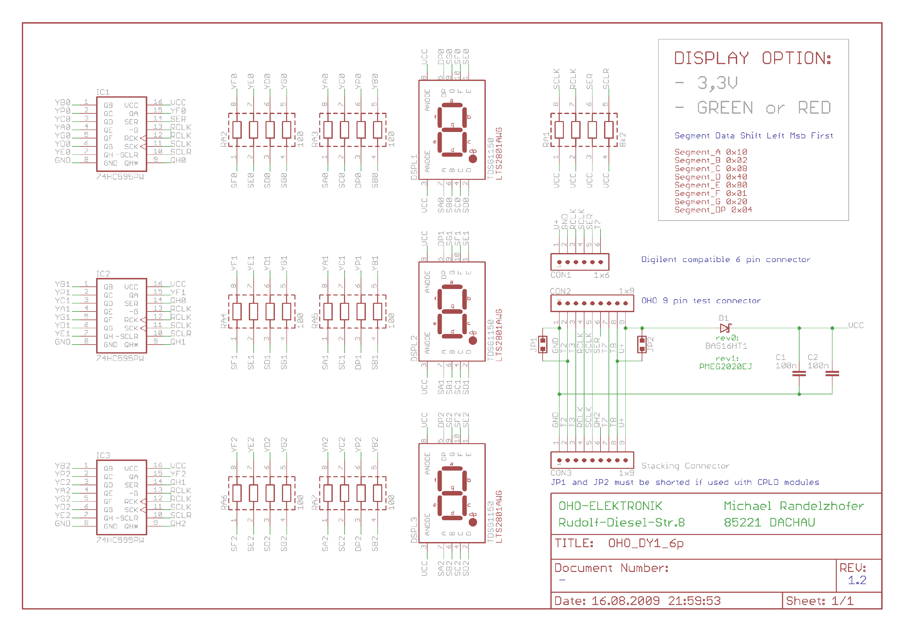

# Display OHO DY1
Usage examples for OHO Elektronik display model OHO_DY1.  
This display has 3 common-anode 7-segments led display. Each display is driven by a 74HC595 shift register. My display works at 3.3V but OHO Elektronik has same model working at 5V, so be careful: don't power the 3.3V display with 5V or it will be broken. More safe try 3.3V first even for 5V display.   
Usage example are for only 1 display board, if you want to stack more boards is simple to edit and add other digits.  
This display has a Pmod connector. Pmod connectors are used by Digilent products: it's the 6-pin header on top.  

### Display Pmod Pinout
Pinout of 6-pin (Pmod) connector on top (digits goes with dot in the lower-right corner). Pin 1 is on the left

| Pin | Function   |
|:----|:-----------|
|1    |+3.3V       |
|2    |GND         |
|3    |LATCH (RCLK)|
|4    |CLOCK (SCLK)|
|5    |DATA (SER)  |
|6    |not used    |

### Display Schematic

### Links
- [OHO Elektronik home](http://www.oho-elektronik.de/)
- [Trenk Electronic shop](https://shop.trenz-electronic.de/de/TE0265-00C-3-3-V-3-Digit-7-Segment-Display-Rot?c=7)
- [Pmod connector](https://store.digilentinc.com/pmod-modules-connectors/)
